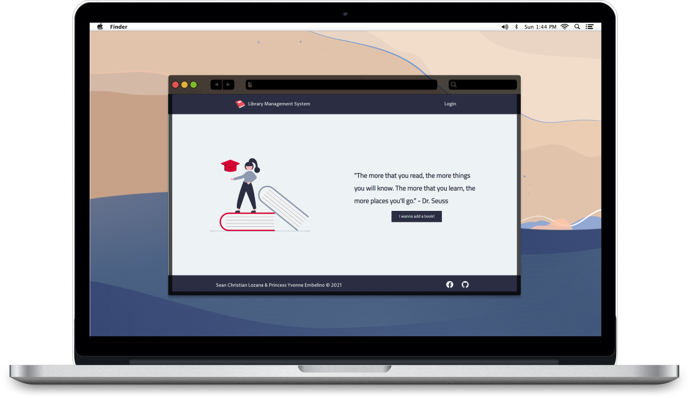
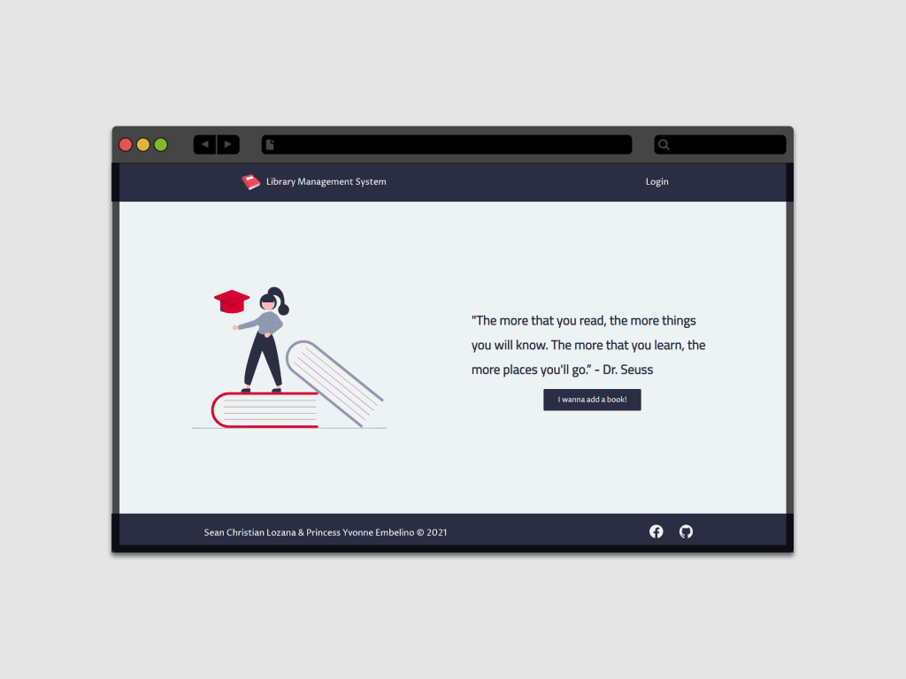
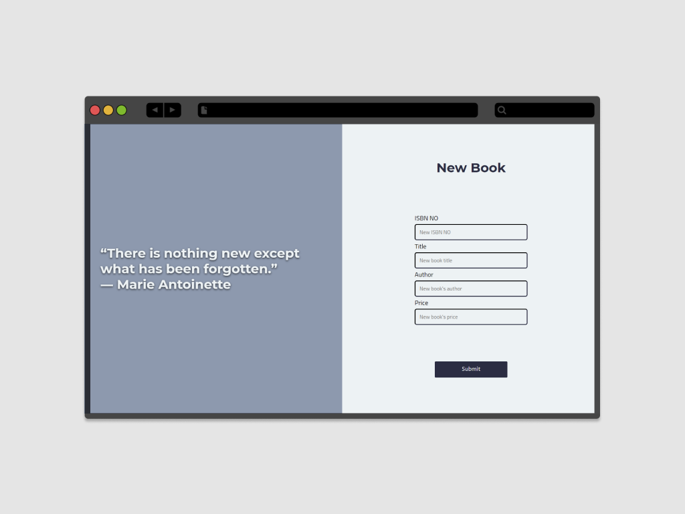
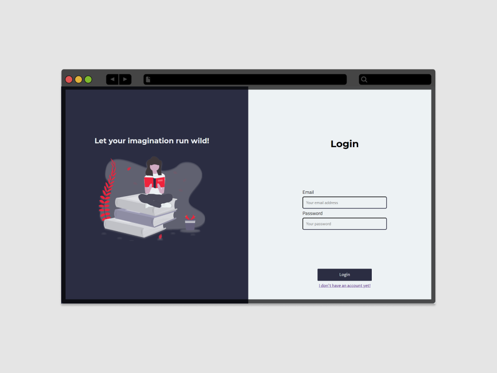
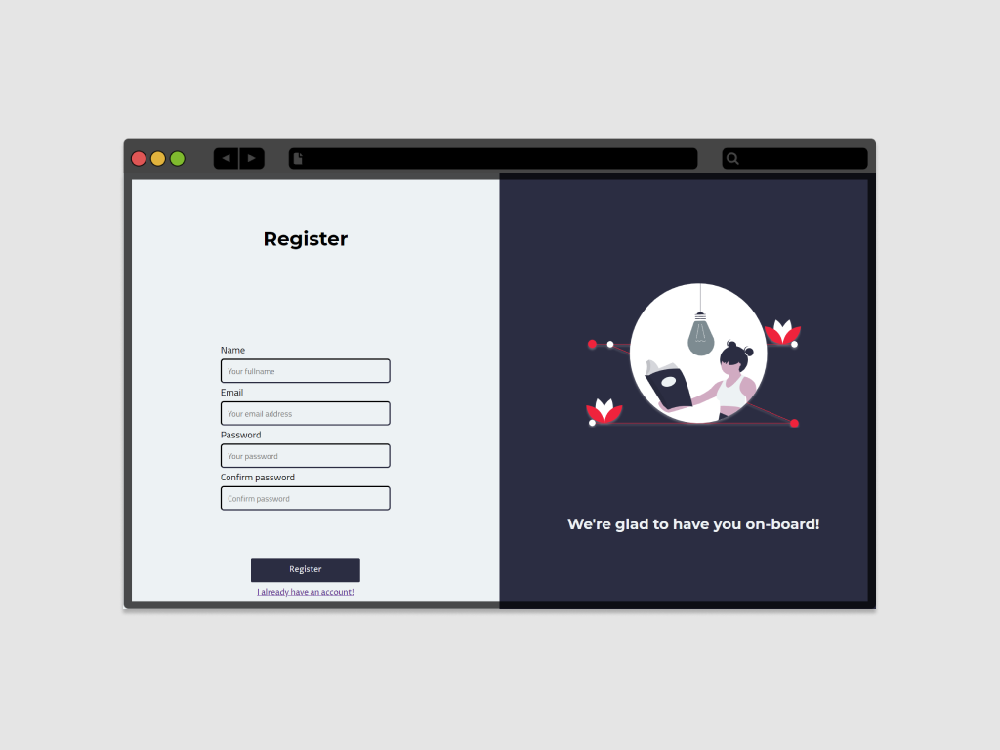
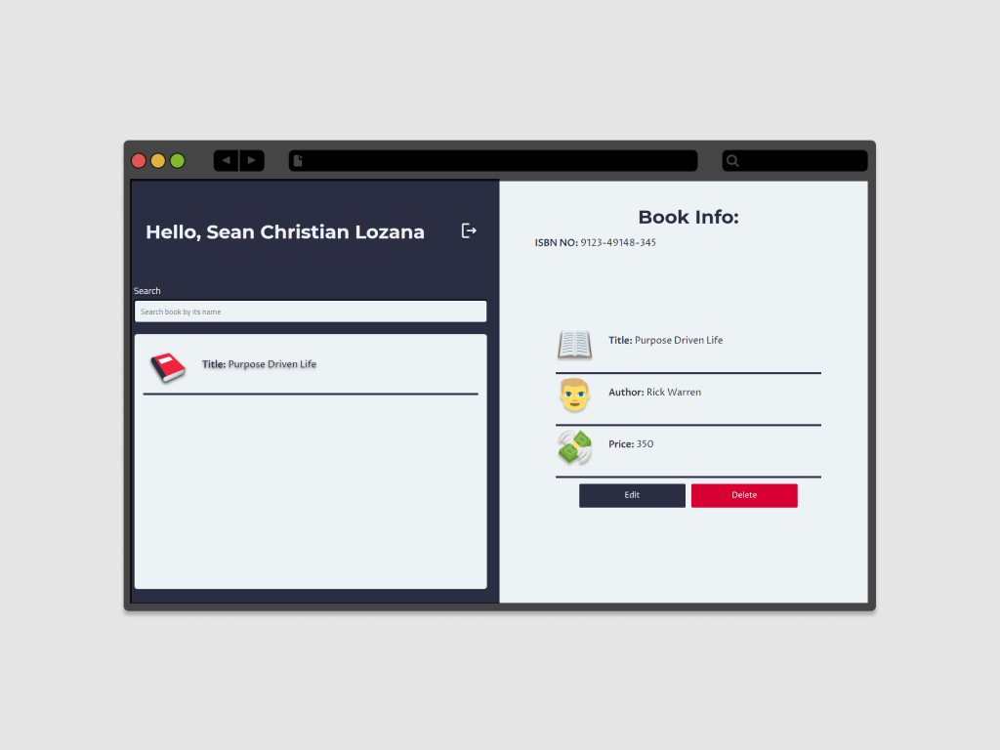
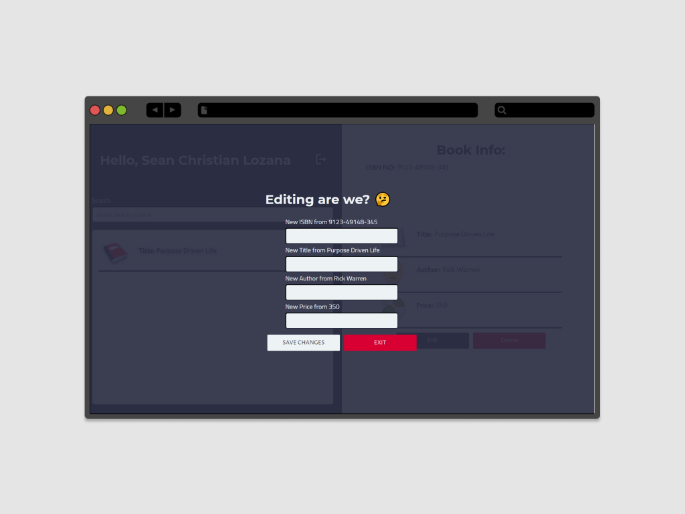
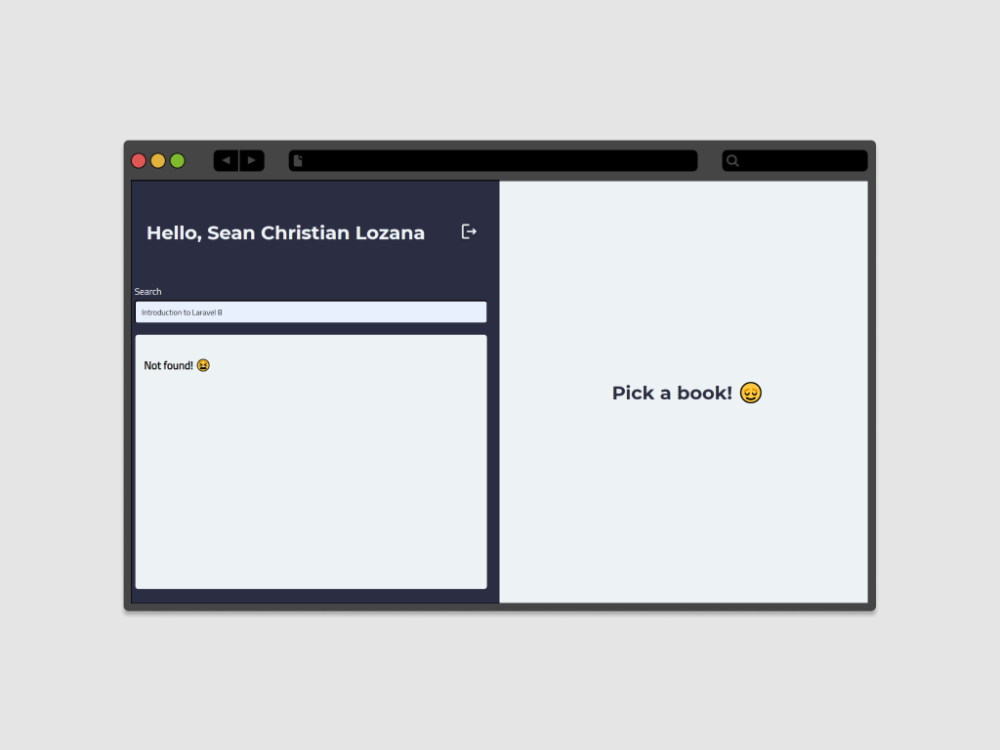

<!-- PROJECT LOGO -->
<br />
<p align="center">
  <a href="https://github.com/lozanasc-archives/Learning-Management-System">
    
  </a>

  <h3 align="center">Book Management System</h3>

  <p align="center">
    A simple Book Management System with Laravel 8 and VanillaJS
    <br />
    <br />
    <a href="">Demo not available</a>
    ·
    <a href="https://github.com/lozanasc-school/Library-Management-System-Laravel-8/issues">Report Bug</a>
    ·
    <a href="https://github.com/lozanasc-school/Library-Management-System-Laravel-8/issues">Request Feature</a>
  </p>
</p>
<br/>
<p align="center">
  <a href=""><b>This project is archived and will not be receiving further updates<b/></a>
</p>


<!-- TABLE OF CONTENTS -->
<details open="open">
  <summary>Table of Contents</summary>
  <ol>
    <li>
      <a href="#about-the-project">About The Project</a>
      <ul>
        <li><a href="#built-with">Built With</a></li>
      </ul>
    </li>
    <li>
      <a href="#getting-started">Getting Started</a>
      <ul>
        <li><a href="#prerequisites">Prerequisites</a></li>
        <li><a href="#installation">Installation</a></li>
      </ul>
    </li>
    <li><a href="#usage">Usage</a></li>
    <li><a href="#roadmap">Roadmap</a></li>
    <li><a href="#contributing">Contributing</a></li>
    <li><a href="#license">License</a></li>
    <li><a href="#contact">Contact</a></li>
    <li><a href="#acknowledgements">Acknowledgements</a></li>
  </ol>
</details>


<!-- ABOUT THE PROJECT -->
## About The Project

  

This website was made for a project in one of our Application Development class, this was the framework we learned in that class  
so our instructor wanted us to make a website using Laravel, this was the requirements for the final project.

### Built With
This system was built with the following technologies:  
* [VanillaJS](https://developer.mozilla.org/en-US/docs/Web/javascript)
* [Laravel 8](https://laravel.com/docs/8.x/readme)
* [PHP](https://www.php.net/docs.php)
* [MySQL](https://www.mysql.com/)


<!-- GETTING STARTED -->
## Getting Started

Hey there! You might be new to Laravel/PHP, just follow the instructions below and you'll running the project in no time! ✨

### Prerequisites

Let's start with the prerequisites, make sure you have the following installed in your local machine:  
* [php](https://www.php.net/downloads.php)
* [composer](https://getcomposer.org/download/)
* [npm](https://nodejs.org/en/)
  ```sh
  npm install npm@latest -g
  ```  
* [nodejs](https://nodejs.org/en/)
  ```sh
  # To check if its installed
  node -v
  ```  
* [mysql server and workbench](https://dev.mysql.com/downloads/windows/installer/8.0.html)  
* [mysql](https://www.mysql.com/)
  ```sh
  mysql -h 127.0.0.1 -u root -p
  ```  

### Installation

1. Clone the repo
   ```sh
   git clone https://github.com/lozanasc-archives/Library-Management-System-Laravel-8.git
   ```  
2. Install composer packages
   ```sh
   composer install
   ```
3. Install NPM packages
   ```sh
   npm install
   ```  
4. Migrate database
   ```sh
   php artisan migrate
   ```
5. Run it! ✨
   ```sh
   # You have to run 2 instances of shell
   # one where you run mix
   npm run watch
   # and one where you serve the laravel server
   php artisan serve
   ```


<!-- USAGE EXAMPLES -->
## Usage
You can do basic CRUD functionalities in this application as shown below:  
### Homepage

### Adding a new book

### Log-in

### Registration

### Dashboard

### Dashboard (Editing)

### Dashboard (Searching)


<!-- ROADMAP -->
## Roadmap

See the [open issues](https://github.com/lozanasc-archives/restoms/issues) for a list of proposed features (and known issues).


<!-- CONTRIBUTING -->
## Contributing

Contributions are what make the open source community such an amazing place to be learn, inspire, and create. Any contributions you make are **greatly appreciated**.

1. Fork the Project
2. Create your Feature Branch (`git checkout -b feature/AmazingFeature`)
3. Commit your Changes (`git commit -m 'Add some AmazingFeature'`)
4. Push to the Branch (`git push origin feature/AmazingFeature`)
5. Open a Pull Request


<!-- LICENSE -->
## License

Distributed under the MIT License. See `LICENSE` for more information.


<!-- CONTACT -->
## Contact

Sean Christian Lozana - [@devzana](https://twitter.com/devzana) - lozanasc@gmail.com

Project Link: [Library Management System with Laravel 8](https://github.com/lozanasc-school/Library-Management-System-Laravel-8)


<!-- ACKNOWLEDGEMENTS -->
## Acknowledgements
* [MDN](https://developer.mozilla.org/en-US/docs/Web/javascript)
* [Laravel 8 Docs](https://laravel.com/docs/8.x/readme)
* [PHP Docs](https://www.php.net/docs.php)
* [MySQL Docs](https://www.mysql.com/)
